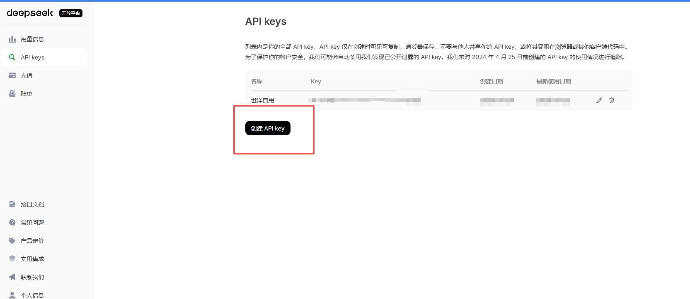
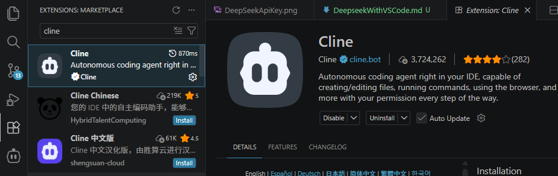
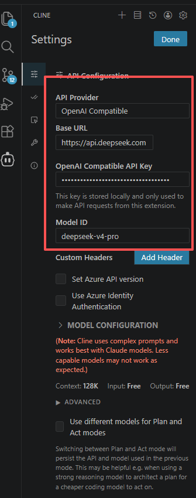

# DeepSeek 购买 API 并获取APIKEY

## 一、 购买deepseek api
https://platform.deepseek.com/

## 二、Vscode 插件商城安装cline

## 三、配置Cline

# [推荐OpenCode]
OpenCode可以直接选DeepSeek的V4模型。

貌似是直接调用Deepseek，不需要通过OpenApi这种中转。

# [只推荐ClaudeCode]
