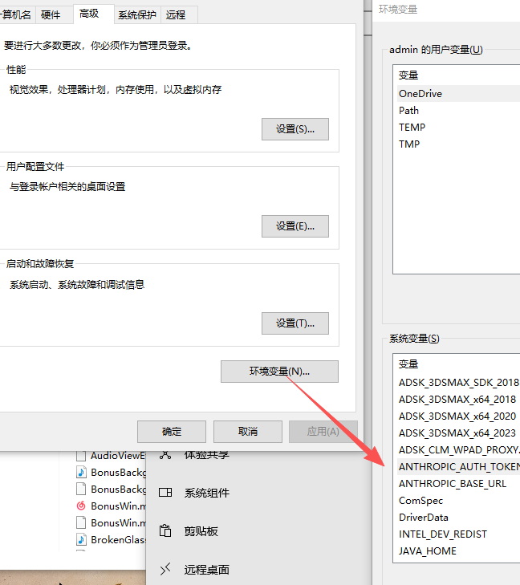
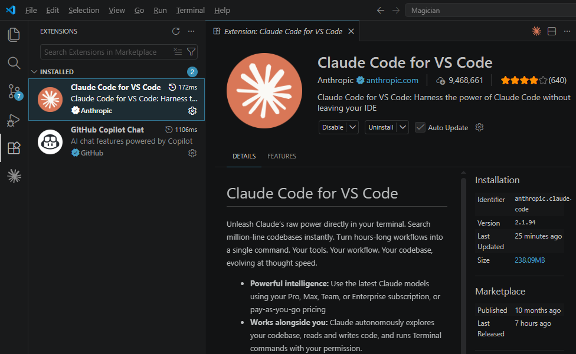
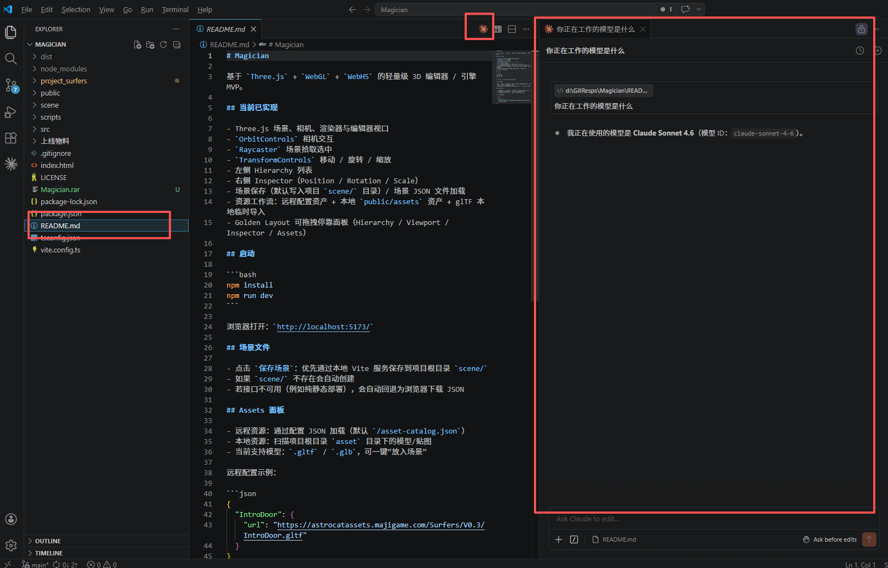

# 在VSCode中使用ClaudeCode URL和Token配置

## 1. 在Windows系统环境变量中增加URl和Token配置

ANTHROPIC_BASE_URL

ANTHROPIC_AUTH_TOKEN

## 2. VSCode中安装ClaudeCode官方插件

## 3.重启VSCode，打开文件夹，点击某一文件即可使用。

# 使用Cline作为Cursor平替
插件商城搜索cline，然后配置即可。