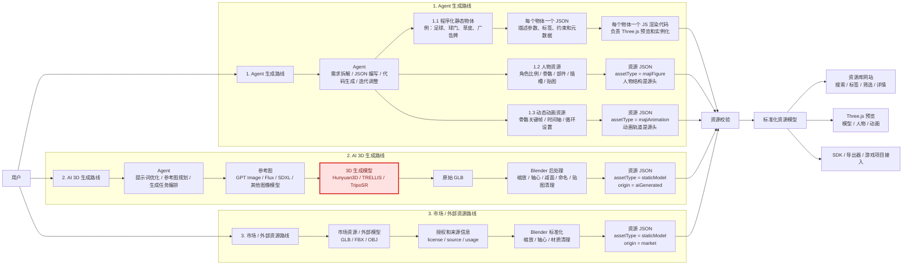

# 一、V0.1 已完成内容展示
## 1. 资源站形式

## 2. 程序化生成的静态资源物体

## 3. 程序化生成的RobloxR6风格人物与动画

## 4. 使用这一套做的足球，足球项目中完全都是程序化生成的模型和贴图。

## TODO 

1. 网站的部署和资源的存放。
   
2. 后面路线图的变更，如果变更，第一点要滞后。

# 二、重要的路线变更，探索专业3d生成LLM
## 已有路线的问题
GPT和Claude生成3D模型能力相对较弱，虽然可以直接生成一些简单的物体，但是整体上能力偏弱，也需要多次调整。

## 解决方案
市面上有开源的大模型，用于3d模型生成，可以用text+图片或图片的形式生成：

* [Hunyuan3D 2.1](https://github.com/Tencent-Hunyuan/Hunyuan3D-2.1)：目前最值得优先研究。显存参考：shape 约 10GB、texture 约 21GB、shape+texture 约 29GB。适合认真做生产管线。
* [TRELLIS / TRELLIS.2](https://github.com/microsoft/TRELLIS.2)：质量最强、显存要求最高， 支持 text/image prompt。
* [TripoSR](https://github.com/VAST-AI-Research/TripoSR)：image-to-3D，质量最差，设备要求最低，适合最先走下流程看看效果。

## 我可能要做的
普遍对现存要求都是大几十GB，我尝试去租GPU部署一下，初步尝试下这些大模型的效果。

# 三、路线图更新

# 四、下一个 Astrocade 配合的游戏项目
1. VR SuperHot改H5

核心玩法是敌人和玩家是同步移动的，玩家动，敌人就动，玩家不动敌人就不动。

[SuperHOt](https://www.bilibili.com/video/BV1HnTM6jEqv/?spm_id_from=333.337.search-card.all.click&vd_source=342ea6147022b7a560919de9a8527dc6)

尝试用2路线做枪械、场景、装饰物品。

2. [做飞车跑酷](https://poki.com/zh/g/super-tunnel-rush)
   
尝试用2路线做场景、装饰。
