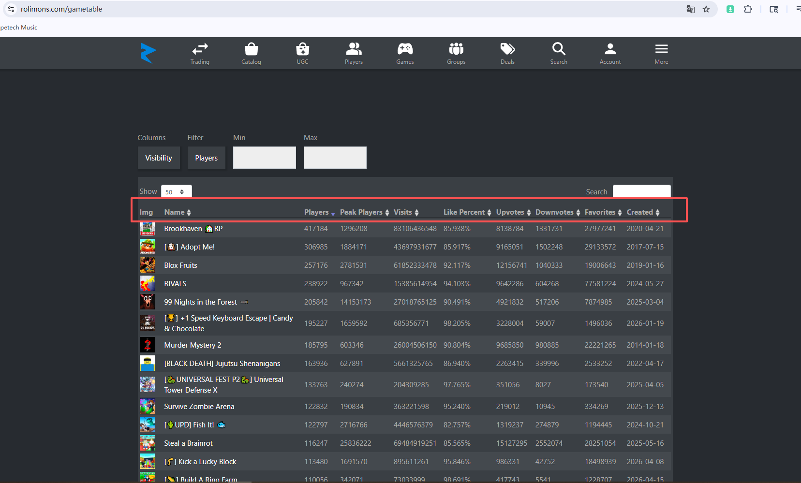
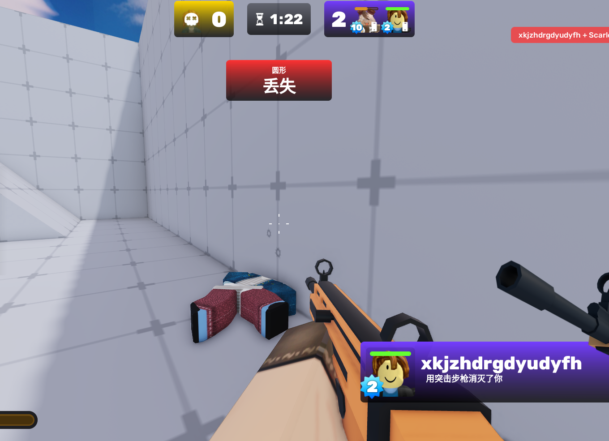
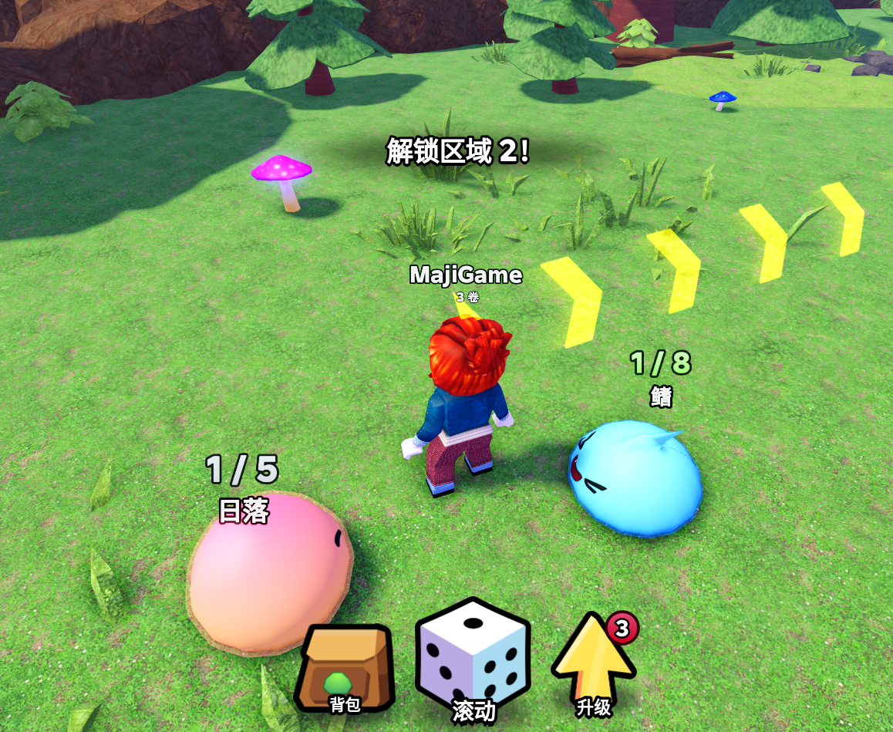
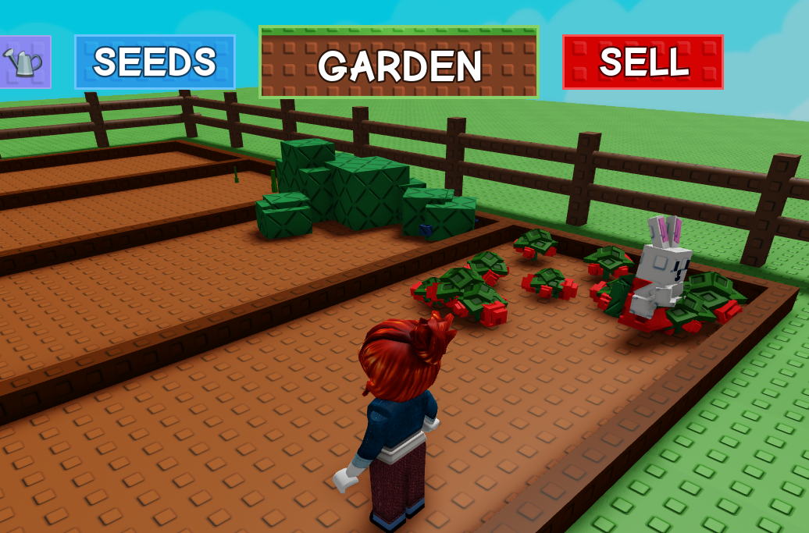
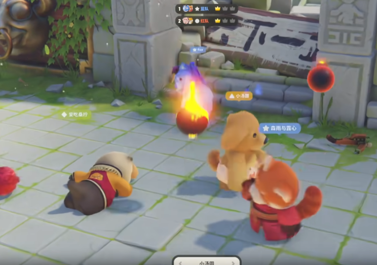

# 1. 数据网站分享
总排名，历史大名单：

https://www.rolimons.com/games

Roblox官网信息：

https://www.roblox.com/charts/top-playing-now

# 2. Roblox Style To H5 实验

## 2.1 目的
验证 Roblox 风格 放到Astrocade等H5小游戏平台表现如何。

## 2.2 分析如何做到Roblox风格的形似和神似
### 2.2.1 尽量保留的Roblox的味道
#### a.Roblox的场景风格
1. 模块化、乐高感重的场景搭建，有搭建感。

2. 低多边形风格
   
3. 鲜明干净的色彩。直接简单粗暴的指示。
   
4. 场景区域化，一般都存在明显的起点、跑酷区、Shop区、多Stage划分。

#### b. Roblox的经典角色形象

#### c. Roblox风格的交互
比如H5游戏一个购买按钮完成的事情，在Roblox中要走到npc附近对话。

玩家解锁、触发可能要在光圈中踩着。

Roblox风格的UI，游戏内的很多信息以场景物体展示，而不是2dUI。

#### d. AI模拟平台玩家,神似
做不了真服务器，要做伪服务器。服务器负责持久化存储、聊天社交、邀请好友、多人游戏逻辑。

单人玩Roblox和看到旁边有角色和你一起，体验上有巨大的差距。可能是最重要的。

第一是AI冒充玩家。

第二是把排行榜3D化到游戏里。

第三 可以做真的，Astrocade没有拦websocket请求，我们可以自己开发服务器玩一下。
#### e. 复刻移动动画 和其他的唐人动画

#### f. Roblox的调性
1. 有开发者分成，导致商店、转盘、签到、等级（等级我们可以做）、装扮、通行证、排行榜 几乎都有，类似魔兽对战平台的游戏，和我的世界完全不同。第一点跟我们做H5没什么关系。
2. 实现每一个小游戏为主。表现可以粗糙或离谱，但是要有反馈。

总结就是：特定的美术风格 就有 Roblox的感觉。 特定的美术风格+服务器+开发者分成=Roblox

### 2.2.2 游戏的复杂度
最初以为很重要，现在觉得不重要。只要实现了2.2.1中的一部分，他就是Roblox风格的游戏，区别只在Roblox味道重不重。

内容复杂度的高低 取决于我们想不想做。

# 3. Roblox To Astrocade 项目挑选几个
挑类别 大于 具体内容

## 3.1 射击类 RIVALS 【推荐】
玩家数历史第四

小地图内的1v1 2v2 NvN
只做左摇杆移动，右摇杆同时负责转向+射击。
做愚蠢的AI对手

## 3.2 OBBY障碍赛
五个角色有五个特性，蜥蜴可以钻洞，猴子可以爬竖直的墙壁，袋鼠可以跳跃更高更远，大象可以撞碎障碍。

## 3.3 挂机数值 类
先找个桩子挂机升级体力，然后找对手打。类似的走一步加速+1，挂机每秒+1跳跃高度之类

## 3.4 抽卡 Slime RNG
玩家数历史前二十。

玩家不用动，摇骰子，抽史莱姆，史莱姆自动找敌人战斗。

玩家移动只是为了找shop升级。

Roblox味道没有那么重。

## 3.5 种田 [⚔️] Grow a Garden 🌶️
玩家数历史前二十

传统的买种子、种地、卖产品。

可能最重要的，是要做npc在旁边跟你竞争或者偷菜。

或许用农产品 还能走 随机合成新东西的这一层玩法！

## 3.6 动作类

类魂游戏天生朝向锁boss方向

不做跑图，做地牢

不做格挡弹反，保留翻滚，做第三人称哈迪斯Style，角色能用各种武器打出相应的动作就行了。

### 变种
做大乱斗，和ai在一个场地上用各种武器和武器技能打架

